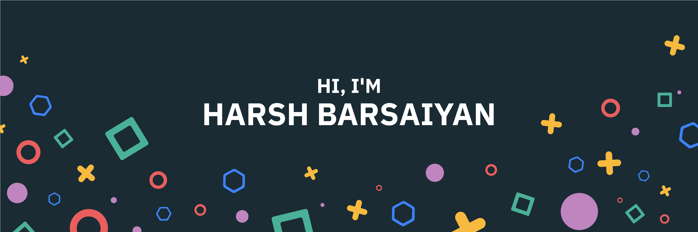

Hey there 👋

I am a 3rd year student at International Institute of Information Technology, Naya Raipur, pursuing my bachelors in Electronics and Communications Engineering. I am a tech enthusiast & an open-source advocate. I am always open to collaborating on projects and innovative/disruptive ideas. Find out more about me & feel free to connect with me here:

## ⚡ Technologies

<!--
**hbarsaiyan/hbarsaiyan** is a ✨ _special_ ✨ repository because its `README.md` (this file) appears on your GitHub profile.

Here are some ideas to get you started:

- 🔭 I’m currently working on ...
- 🌱 I’m currently learning ...
- 👯 I’m looking to collaborate on ...
- 🤔 I’m looking for help with ...
- 💬 Ask me about ...
- 📫 How to reach me: ...
- 😄 Pronouns: ...
- ⚡ Fun fact: ...
-->
